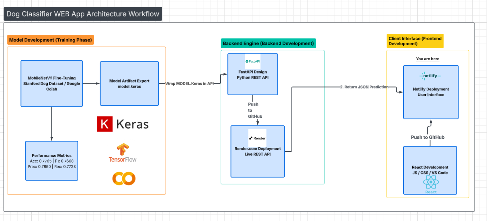

# 🐶 Kevon’s Dog Breed Classifier

This is an end-to-end Machine Learning project built to demonstrate production deployment of a deep learning model.

I fine-tuned MobileNetV2 on the Stanford Dogs dataset to classify dog breeds from images. The trained model is deployed through a FastAPI backend hosted on Render, with a responsive React frontend deployed on Netlify.

The application allows users to upload an image and receive real-time breed predictions through a REST API pipeline.

**🏗 System Architecture**

The system follows a three-tier architecture:

  

Frontend (React + Netlify)

- Handles user interaction

- Uploads images via HTTP request

Backend (FastAPI + Render)

- Receives image file

- Preprocesses input

- Runs model inference

- Returns prediction JSON

Model (MobileNetV2 + TensorFlow/Keras)

- Fine-tuned on Stanford Dogs dataset

- Performs image classification

- Outputs breed prediction with confidence score

**🌐 Live Demo**

🔗 [React APP ](https://kevonsdogclassifier.netlify.app/)

🔗 [Backend API](https://standford-dog-classifier.onrender.com)
